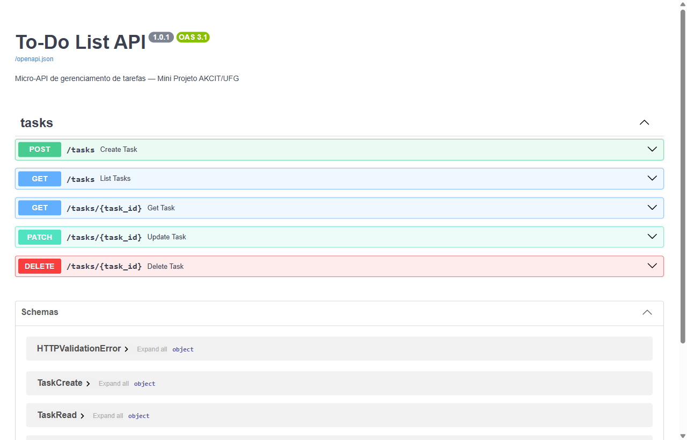

# To-Do List API

Micro-API RESTful para gerenciamento de tarefas: criar, listar, atualizar, concluir e excluir tarefas, com filtro por status. Os dados ficam em um banco SQLite local.

Mini projeto da pós-graduação UFG / AKCIT, desenvolvido com o auxílio de IA generativa em todas as etapas, da arquitetura aos testes.

## Funcionalidades

- CRUD completo de tarefas (`/tasks`)
- Marcar tarefa como concluída (`status: done`)
- Filtrar a listagem por status (`pending` ou `done`)
- Validação dos dados de entrada, com respostas `422` claras
- Documentação interativa automática (Swagger UI) em `/docs`

## Tecnologias

| Item | Tecnologia |
|---|---|
| Linguagem | Python 3.12+ |
| Gerenciador de pacotes | [uv](https://docs.astral.sh/uv/) |
| Framework web | [FastAPI](https://fastapi.tiangolo.com/) + Uvicorn |
| ORM e validação | [SQLModel](https://sqlmodel.tiangolo.com/) (SQLAlchemy + Pydantic) |
| Banco de dados | SQLite |
| Testes | pytest + `TestClient` (httpx2) |
| Lint e formatação | Ruff |
| IA generativa | [Claude Code](https://claude.com/claude-code) (Anthropic), com o modelo **Claude Opus 5.5** |

## Como rodar localmente

### Pré-requisitos

- **[Git](https://git-scm.com/downloads)**, para clonar o repositório.
- **[uv](https://docs.astral.sh/uv/)**, para instalar as dependências e rodar a aplicação. Se o Python 3.12+ não estiver instalado, o uv baixa uma versão automaticamente.

Para instalar o uv (depois, feche e abra o terminal):

```powershell
# Windows (PowerShell)
powershell -ExecutionPolicy ByPass -c "irm https://astral.sh/uv/install.ps1 | iex"
```

```bash
# Linux / macOS
curl -LsSf https://astral.sh/uv/install.sh | sh
```

### Início rápido: um comando

Este comando clona o projeto, instala as dependências e inicia a API:

```bash
# Linux / macOS / Git Bash
git clone https://github.com/iwarneto/iwar-todo-list-akcit.git && cd iwar-todo-list-akcit && uv run uvicorn app.main:app
```

```powershell
# Windows (PowerShell)
git clone https://github.com/iwarneto/iwar-todo-list-akcit.git; cd iwar-todo-list-akcit; uv run uvicorn app.main:app
```

Quando aparecer `Uvicorn running on http://127.0.0.1:8000`, acesse **http://127.0.0.1:8000/docs** para testar a API pelo navegador. Para encerrar, pressione `Ctrl+C`.

> O `uv run` cria o ambiente virtual e instala as versões exatas do `uv.lock` antes de executar. Por isso não há etapa de instalação separada.



### Passo a passo com uv

1. Clone o repositório e entre na pasta:
   ```bash
   git clone https://github.com/iwarneto/iwar-todo-list-akcit.git
   cd iwar-todo-list-akcit
   ```
2. Instale as dependências:
   ```bash
   uv sync
   ```
3. Inicie a API (o `--reload` reinicia o servidor quando o código muda):
   ```bash
   uv run uvicorn app.main:app --reload
   ```
4. Acesse **http://127.0.0.1:8000/docs**. O banco `todo.db` é criado automaticamente na primeira execução.
5. Em outro terminal, na mesma pasta, rode os testes:
   ```bash
   uv run pytest
   ```

### Alternativa com pip

Para quem prefere não usar o uv (requer Python 3.12+ instalado):

```bash
python -m venv .venv
.venv\Scripts\activate          # Windows
# source .venv/bin/activate     # Linux / macOS
pip install -r requirements.txt
uvicorn app.main:app --reload
```

### Atalhos com Makefile (opcional)

O `Makefile` reúne os comandos do dia a dia. Ele precisa do `make`, que é nativo no Linux e no macOS. Se o comando `make --version` não funcionar, instale:

```powershell
# Windows (depois, feche e abra o terminal)
winget install ezwinports.make
```

```bash
# macOS
xcode-select --install

# Ubuntu / Debian
sudo apt install make
```

Depois, na pasta do projeto:

| Comando | O que faz |
|---|---|
| `make install` | Instala as dependências (`uv sync`) |
| `make run` | Inicia a API com recarga automática (e instala o que faltar) |
| `make test` | Executa os testes |
| `make lint` | Verifica estilo e formatação sem alterar arquivos |
| `make format` | Corrige o estilo e formata o código |
| `make requirements` | Regenera o `requirements.txt` a partir do `uv.lock` |

## Endpoints

| Método | Rota | Descrição | Sucesso |
|---|---|---|---|
| `POST` | `/tasks` | Cria uma tarefa | `201` |
| `GET` | `/tasks` | Lista as tarefas (`?status=pending` ou `?status=done`) | `200` |
| `GET` | `/tasks/{id}` | Busca uma tarefa | `200` |
| `PATCH` | `/tasks/{id}` | Atualiza os campos enviados | `200` |
| `DELETE` | `/tasks/{id}` | Exclui uma tarefa | `204` |

Uma tarefa inexistente retorna `404`, e dados inválidos retornam `422`.

## Exemplos de uso

> No Windows PowerShell, use `curl.exe` em vez de `curl`.

**Criar uma tarefa**

```bash
curl -X POST http://127.0.0.1:8000/tasks \
  -H "Content-Type: application/json" \
  -d '{"title": "Estudar FastAPI", "description": "Capítulo 2"}'
```

```json
{
  "title": "Estudar FastAPI",
  "description": "Capítulo 2",
  "id": 1,
  "status": "pending",
  "created_at": "2026-10-08T19:38:15.591110Z"
}
```

**Marcar como concluída**

```bash
curl -X PATCH http://127.0.0.1:8000/tasks/1 \
  -H "Content-Type: application/json" \
  -d '{"status": "done"}'
```

**Listar só as tarefas pendentes**

```bash
curl "http://127.0.0.1:8000/tasks?status=pending"
```

**Excluir**

```bash
curl -X DELETE http://127.0.0.1:8000/tasks/1
```

## Testes

```bash
uv run pytest
```

São 24 testes: 5 unitários da camada de serviço e 19 dos endpoints. Eles usam um SQLite em memória, isolado a cada teste, e não alteram o `todo.db`.

Para checar o estilo do código:

```bash
uv run ruff check .
```

## Estrutura do projeto

```
app/
├── main.py          # aplicação FastAPI e tratamento de erros
├── routes.py        # endpoints (controller)
├── service.py       # regras de negócio
├── repository.py    # acesso ao banco
├── models.py        # tabela Task e schemas de entrada e saída
└── database.py      # conexão com o SQLite
tests/
├── conftest.py      # fixtures: banco em memória e cliente HTTP
├── test_service.py
└── test_api.py
docs/
├── arquitetura.md   # diagramas Mermaid e decisões de arquitetura
└── img/             # capturas de tela
Makefile             # atalhos: install, run, test, lint, format
```

A arquitetura em camadas (controller → service → repository) e os diagramas estão em [docs/arquitetura.md](docs/arquitetura.md).

## Como a IA acelerou este projeto

O projeto foi construído em pareamento com o **Claude Code** (modelo **Claude Opus 5.5**), seguindo as etapas do material da disciplina. A IA propôs e implementou; as decisões de escopo, a aprovação de cada etapa e a validação final ficaram com o autor.

### Ganhos de produtividade

A estimativa do autor é de **cerca de 1 semana** para fazer o projeto sem IA. Com o Claude Code, o núcleo ficou pronto em **cerca de 1 hora**: código, 24 testes, diagramas, README e release. O ganho maior veio do que costuma consumir mais tempo e menos raciocínio: boilerplate das camadas, casos de teste de erro e documentação.

### Desafios superados com a IA

- **Material desatualizado.** O material da disciplina sugere `pip` + `requirements.txt`, `psycopg2` e `black`. A IA comparou essa stack com alternativas atuais, e o projeto adotou **uv**, **SQLModel** e **Ruff**. O `requirements.txt` continua sendo gerado a partir do `uv.lock`, para quem prefere `pip`.
- **Dependências infladas.** O pacote recomendado pela documentação do FastAPI, `fastapi[standard]`, instalava **58 pacotes**, incluindo telemetria e um CLI de nuvem. Declarar só o necessário reduziu esse número para **26**, com a mesma funcionalidade.
- **Depreciação e alerta de segurança.** O Starlette 1.7 deprecou o `httpx` no cliente de testes. A troca para `httpx2` disparou um alerta automático de possível *typosquatting*. Em vez de aceitar ou ignorar o alerta, as evidências foram verificadas: o próprio Starlette pede o pacote, que é mantido pela Pydantic e tem a versão travada no lockfile. Conclusão: falso positivo.
- **Caso de borda na atualização.** Um `PATCH {"title": null}` passaria pela validação e quebraria no banco com erro `500`. Um validador passou a recusar `null` nos campos obrigatórios, e testes cobrem esse caso.

### Decisões de design

A IA poderia justificar Docker, PostgreSQL, migrations e interfaces abstratas para o repository. Todas foram **recusadas de propósito**: este é um MVP, e cada uma dessas peças aumentaria a complexidade sem resolver nenhum problema atual. A arquitetura em camadas foi mantida porque isola o acesso ao banco e deixa essas evoluções baratas no futuro (veja [Limitações e próximos passos](#limitações-e-próximos-passos)).

### Lições aprendidas

- **Revisão humana continua indispensável.** Uma revisão de SOLID/DRY depois do código gerado encontrou regras de validação duplicadas, e elas foram centralizadas.
- **Verificar vale nos dois sentidos.** Vale tanto para as sugestões da IA quanto para os alertas automáticos. Evidência pesa mais do que confiança.
- **Testar como quem vai avaliar.** O repositório foi clonado do zero, e as instruções do README foram executadas com uv e com pip antes da entrega.
- **Um bom prompt tem contexto, objetivo e restrições.** Deixar claro que era "um mini projeto simples" mudou a qualidade das sugestões.

### Etapa por etapa

| Etapa | Como a IA ajudou |
|---|---|
| Configuração do repositório | Geração do `.gitignore` e do `.gitattributes`, e criação do repositório no GitHub |
| Escolha de tecnologias | Comparação entre a stack do material e alternativas atuais (uv, SQLModel, Ruff), com foco em manter o projeto simples |
| Arquitetura | Diagramas de componentes e de sequência em Mermaid, e a estrutura de pastas |
| Dependências | Seleção enxuta dos pacotes, trocando `fastapi[standard]` (58 pacotes) por dependências explícitas (26 pacotes) |
| Código | Models, repository, service e endpoints |
| Testes | Fixtures com banco em memória e casos de sucesso e de erro |
| Commits | Mensagens no padrão [Conventional Commits](https://www.conventionalcommits.org/pt-br/v1.0.0/) |
| Automação | `Makefile` com os comandos do dia a dia |
| Documentação | Este README e a captura de tela do Swagger |

## Limitações e próximos passos

**Limitações atuais**

- Sem autenticação: qualquer pessoa com acesso à API vê e altera todas as tarefas.
- SQLite em arquivo local, adequado para uso individual e não para muitos acessos simultâneos.
- Sem migrations: se o modelo mudar, é preciso apagar o `todo.db` para recriar a tabela.
- A listagem não tem paginação.

**Próximos passos possíveis**

- Frontend em React consumindo a API.
- Autenticação com JWT e tarefas por usuário.
- PostgreSQL com migrations via Alembic. Como o acesso ao banco está isolado no repository, a troca exige poucas mudanças.
- Paginação e ordenação na listagem, além de campos como prazo e prioridade.
- CI no GitHub Actions rodando testes e lint a cada push.

## Créditos e licença

Desenvolvido por **[iwarneto](https://github.com/iwarneto)** como mini projeto da pós-graduação UFG / AKCIT, a partir da sugestão "Micro-API de Gerenciamento de Tarefas (To-Do List)" do material da disciplina.

Distribuído sob a licença MIT. Veja [LICENSE](LICENSE).
