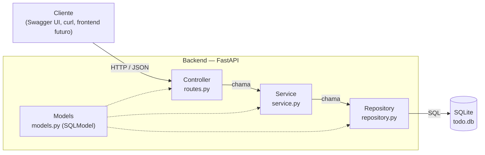
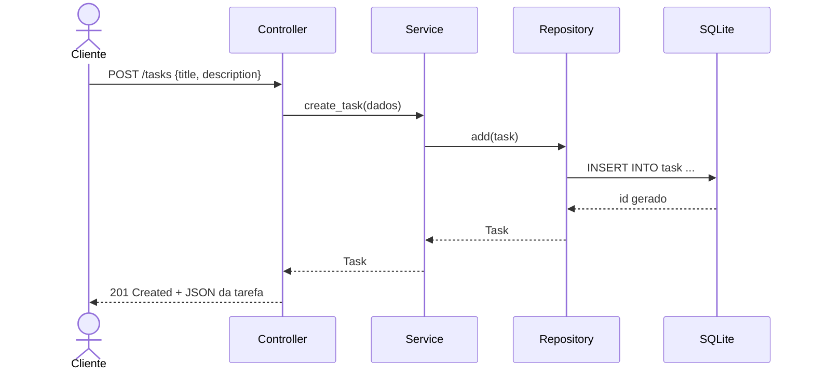

# Arquitetura — Micro-API To-Do List

API RESTful simples para criar, listar, atualizar e excluir tarefas, com filtro por status e opção de marcar como concluída.

## Stack

| Camada | Tecnologia |
|---|---|
| Linguagem / gerenciador | Python 3.12+ / [uv](https://docs.astral.sh/uv/) |
| Framework web | FastAPI |
| ORM + validação | SQLModel (SQLAlchemy + Pydantic) |
| Banco de dados | SQLite (arquivo local `todo.db`) |
| Testes | pytest + `TestClient` do FastAPI |
| Lint / formatação | Ruff |

## Diagrama de componentes



Responsabilidade de cada camada:

- **Controller (`routes.py`)**: recebe as requisições HTTP, valida a entrada (via schemas) e devolve as respostas com o status code adequado.
- **Service (`service.py`)**: contém as regras de negócio, como "tarefa não encontrada → erro 404" e "marcar como concluída".
- **Repository (`repository.py`)**: é o único ponto que fala com o banco (consultas, inserções, atualizações e exclusões).
- **Models (`models.py`)**: a tabela `Task` e os schemas de entrada e saída (`TaskCreate`, `TaskUpdate`, `TaskRead`).

## Fluxo de uma requisição (criar tarefa)



## Endpoints

| Método | Rota | Descrição |
|---|---|---|
| `POST` | `/tasks` | Cria uma tarefa |
| `GET` | `/tasks` | Lista as tarefas (filtro opcional `?status=pending` ou `?status=done`) |
| `GET` | `/tasks/{id}` | Busca uma tarefa pelo id |
| `PATCH` | `/tasks/{id}` | Atualiza campos da tarefa, inclusive o status para marcar como concluída |
| `DELETE` | `/tasks/{id}` | Exclui uma tarefa |

## Modelo de dados

| Campo | Tipo | Observação |
|---|---|---|
| `id` | int | Chave primária, gerada automaticamente |
| `title` | str | Obrigatório |
| `description` | str \| null | Opcional |
| `status` | `pending` \| `done` | Padrão: `pending` |
| `created_at` | datetime | Preenchido na criação |

## Estrutura de pastas

```
iwar-todo-list-akcit/
├── app/
│   ├── __init__.py
│   ├── main.py          # cria a aplicação FastAPI e registra as rotas
│   ├── database.py      # engine do SQLite e sessão por requisição
│   ├── models.py        # tabela Task + schemas de entrada/saída
│   ├── repository.py    # acesso ao banco
│   ├── service.py       # regras de negócio
│   └── routes.py        # endpoints (controller)
├── tests/
│   ├── conftest.py      # fixtures: banco em memória e cliente HTTP
│   ├── test_service.py  # testes unitários do service
│   └── test_api.py      # testes dos endpoints
├── docs/
│   ├── arquitetura.md   # este documento
│   └── img/             # capturas de tela
├── Makefile             # atalhos: install, run, test, lint, format
├── pyproject.toml       # dependências e configuração (uv, Ruff, pytest)
├── uv.lock              # versões travadas
├── requirements.txt     # exportado do uv.lock, para quem usa pip
├── LICENSE
└── README.md
```

## Uso de IA nesta etapa

Prompt base (seção 2.2.1 do material, adaptado):

> **Contexto:** estou projetando uma Micro-API de gerenciamento de tarefas em Python com FastAPI, SQLModel e SQLite. O backend deve ter as camadas controller, service e repository.
> **Objetivo:** criar um diagrama de componentes em Mermaid mostrando a interação entre cliente, backend e banco de dados, e um diagrama de sequência para a criação de uma tarefa.
> **Estilo:** diagrama de componentes simples, com as setas de comunicação identificadas.
> **Resposta:** apenas o código Mermaid.
